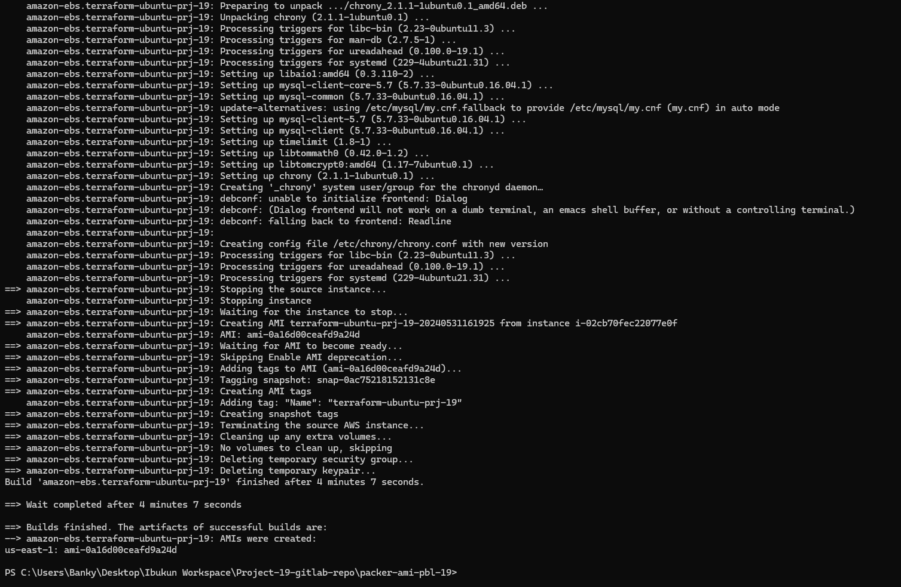

## **Documentation for Project 19**
## **Automating our Infrastructure with terraform using terraform cloud**

### Creating terraform cloud account and organization

### Configuring our Workspace on Terraform Cloud, so we need to configure access to our version control system which is Gitlab on Terraform Cloud using the credentials provided by terraform cloud.

### Configuring Version control system on terraform cloud

### Using the Open Authentication application on gitlab, we integrate gitlab with Terraform cloud using the credentials provided by terraform cloud and gitlab

### Workspace created

### Configuring Workspace Environmental variables

### Packer Installation

### Amazon Plugin for packer Installed

### Packer Build run for Bastion, error encountered and AMI Changed to an available one

### AMI Changed to an available one and bastion ami built successfully with packer

### AMI available on Console and Instance terminated

### Packer Build run for Nginx

### Nginx AMI available on Console

### Packer Build run for Ubuntu

### Ubuntu AMI available on Console

### Packer Build run for Web AMI

### WEB AMI available on Console

